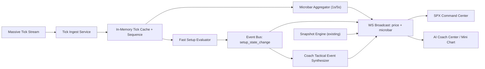

# SPX + AI Coach Tick-Level Rollout Plan

**Date:** February 17, 2026  
**Scope:** Backend market ingestion, websocket fanout, SPX Command Center chart/trigger timing, AI Coach chart/context updates  
**Goal:** Introduce tick-level responsiveness safely without turning core setup/coach systems into noisy, unstable firehoses.

## 1. Current State (as implemented)
- Backend websocket (`/ws/prices`) currently broadcasts `price` on polling cadence, not true tick stream:
  - regular hours: 30s
  - extended hours: 60s
  - closed: 5m
  - source: `backend/src/services/websocket.ts`
- SPX snapshot pipeline is deterministic and snapshot-first:
  - source: `backend/src/services/spx/index.ts`
- AI Coach center and inline mini-chart already support realtime tick-to-bar merge when they receive price updates:
  - source: `components/ai-coach/center-panel.tsx`
  - source: `components/ai-coach/inline-mini-chart.tsx`
  - source: `components/ai-coach/chart-realtime.ts`
- SPX Command Center chart now uses the same realtime merge pattern on incoming SPX websocket updates:
  - source: `components/spx-command-center/spx-chart.tsx`

## 2. Architecture Decision
Adopt a **hybrid tick architecture**:
- Tick-level stream for **price transport + microbar construction + fast trigger evaluation**.
- Snapshot engine remains source of truth for heavy state (levels, clusters, GEX, flow synthesis, coaching state).
- AI Coach consumes **derived tactical events**, not raw tick spam.

This preserves determinism while delivering live responsiveness.

## 3. Benefits We Want
- Near-real-time entry/stop/target transition detection.
- Candles update continuously during active sessions.
- Faster user trust loop in SPX + AI Coach surfaces.
- Better event timing for tactical coach alerts.

## 4. Risks to Control
- Alert noise and false positives from microstructure whipsaw.
- WS fanout load and browser render pressure.
- Drift between tick evaluator state and snapshot state.
- Out-of-order/duplicate tick handling complexity.

## 5. Target End-State (Dataflow)

## 6. Implementation Plan

## Phase 1: Tick Ingest Foundation (Backend)
**Objective:** Replace polling-only price feed with real tick ingress.

**Build**
- Add new service `backend/src/services/massiveTickStream.ts`:
  - connect/auth to Massive websocket
  - subscribe to SPX/SPY tick feeds
  - normalize tick payload (`symbol`, `price`, `size`, `ts`, `seq`)
  - heartbeat/reconnect/backoff
  - dedupe/out-of-order guards
- Add bounded in-memory store `backend/src/services/tickCache.ts`:
  - last tick by symbol
  - rolling buffer (e.g., 5-10 minutes)
  - monotonic sequence tracking
- Boot/teardown integration:
  - initialize in `backend/src/server.ts`
  - graceful shutdown close.

**Acceptance gates**
- Tick stream stays connected through market session.
- No unbounded memory growth.
- No reconnect storm under transient network loss.

## Phase 2: WebSocket Fanout Upgrade
**Objective:** Broadcast real tick updates with safe client load.

**Build**
- Extend `backend/src/services/websocket.ts`:
  - broadcast tick-derived `price` updates immediately (throttled per symbol, e.g., 100-250ms max rate).
  - keep existing `status` and SPX channel model.
  - keep polling fallback path when tick stream unavailable.
- Add message metadata:
  - `source: 'tick' | 'poll'`
  - `seq`
  - `latencyMs` (optional, debug mode)

**Acceptance gates**
- Clients receive sub-second price updates in regular hours.
- Browser CPU remains acceptable at 1-2 subscribed symbols.
- Automatic fallback to polling when tick feed drops.

## Phase 3: Microbar + Fast Setup Evaluator
**Objective:** Enable near-real-time setup state transitions without recomputing full snapshot per tick.

**Build**
- Add `backend/src/services/spx/tickEvaluator.ts`:
  - inputs: current active setups + incoming tick
  - outputs: setup transition events (`ready -> triggered`, `triggered -> invalidated`, etc.)
  - hysteresis/debounce rules to avoid flicker.
- Add `backend/src/services/spx/microbarAggregator.ts`:
  - derive 1s/5s bars from ticks
  - publish microbar updates for chart overlays.
- Keep `backend/src/services/spx/index.ts` snapshot cadence unchanged (deterministic heavy compute).

**Acceptance gates**
- Setup transition events are monotonic and deduped.
- No full snapshot recompute per tick.
- Event timing improves vs current 30s cadence.

## Phase 4: AI Coach Tactical Event Layer
**Objective:** Convert fast events into bounded, useful coach actions.

**Build**
- Add `backend/src/services/spx/tacticalAdvisor.ts`:
  - consume tick evaluator events + snapshot context
  - emit high-value event types only:
    - `entry_window_opened`
    - `stop_threat`
    - `target1_touched`
    - `flow_divergence_detected`
- Integrate with coach messaging pipeline:
  - do not create message spam
  - cooldown windows + coalescing logic.

**Acceptance gates**
- Coach alert volume controlled (no flood).
- Alert relevance improves measured by acknowledgment rate.

## Phase 5: Frontend Consumption Hardening
**Objective:** Keep UI smooth under higher-frequency feeds.

**Build**
- SPX Command Center:
  - retain tick->bar merge (`components/spx-command-center/spx-chart.tsx`)
  - add client-side render throttling where needed.
- AI Coach center + mini chart:
  - keep existing merge pipeline; enforce dedupe by `seq/timestamp`.
- Add stream diagnostics badge in both surfaces:
  - mode (`tick` vs `poll`)
  - update rate
  - last tick age.

**Acceptance gates**
- Chart remains >=30fps during active feed.
- No uncontrolled rerender loops.
- Mobile battery/cpu remains acceptable.

## Phase 6: Observability + SLOs
**Objective:** Make tick rollout measurable and reversible.

**Build**
- Add counters/histograms:
  - `tick_ingest_rate`
  - `tick_drop_count`
  - `ws_price_broadcast_rate`
  - `setup_transition_latency_ms`
  - `coach_tactical_alert_rate`
- Sentry breadcrumbs for:
  - feed failover poll<->tick
  - evaluator state conflicts
  - reconnect/backoff transitions.

**SLO targets**
- p95 tick-to-client price latency < 500ms during regular hours.
- setup transition emit latency < 1000ms from tick ingest.
- feed availability (tick or fallback poll) > 99.5% session time.

## 7. Guardrails and Rules
- Never feed raw tick stream directly into LLM prompts.
- Emit coach events only from derived tactical state.
- Deduplicate by `symbol + seq` (or fallback `symbol + ts + price + size`).
- Apply cooldowns for repeated setup alerts.
- Preserve snapshot-first contract for heavy SPX domain objects.

## 8. Rollout Strategy (Commit-Gated)
1. Ship backend tick ingest in passive mode (no client fanout).
2. Enable tick fanout for internal/test users only.
3. Enable fast setup evaluator events (logging only).
4. Enable user-visible tactical alerts after false-positive review.
5. Keep rollback path: disable tick ingest service and fall back to current polling websocket path.

## 9. Test Plan

### Unit
- tick dedupe/out-of-order handling
- microbar bucket correctness
- setup transition state machine monotonicity
- tactical alert cooldown/coalescing

### Integration
- Massive tick disconnect/reconnect
- websocket fallback tick -> poll and poll -> tick
- snapshot + tick evaluator consistency checks

### E2E
- SPX chart updates within sub-second cadence when market feed active
- setup transitions visible near real time
- AI coach receives tactical alert only once per transition window

## 10. Suggested First Milestone (1-2 days)
- Build Phase 1 + Phase 2 only (ingest + fanout), behind internal routing switch.
- Do not change setup/coach semantics in milestone 1.
- Validate latency/load and stability before enabling fast evaluator logic.

## 11. File-Level Change Map
- `backend/src/server.ts` (bootstrapping tick stream)
- `backend/src/services/websocket.ts` (fanout + fallback)
- `backend/src/config/massive.ts` (websocket client helpers, if colocated)
- `backend/src/services/spx/tickEvaluator.ts` (new)
- `backend/src/services/spx/microbarAggregator.ts` (new)
- `backend/src/services/spx/tacticalAdvisor.ts` (new)
- `components/spx-command-center/spx-chart.tsx` (consume stream metadata)
- `components/ai-coach/center-panel.tsx` (consume stream metadata)
- `components/ai-coach/inline-mini-chart.tsx` (consume stream metadata)
- `hooks/use-price-stream.ts` (protocol additions, diagnostics)

## 12. Explicit Recommendation
Implement tick-level **transport first**, then tick-level **decisioning**.  
Do not couple both on day one. This keeps reliability high while still delivering immediate UX value.
